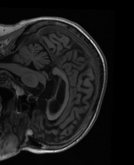
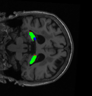
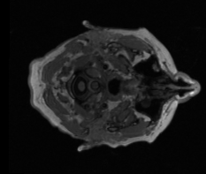

# Hipposeg


Hippocampal segmentation using the  UNet network for each axis, inspired by  https://github.com/MICLab-Unicamp/e2dhipseg

     

* **Red**:   False Positive
* **Green**: True Positive
* **Blue**:  False Negative

## Install 

### Clone the repository 

```shell
git clone https://github.com/aguirrejuan/hipposeg.git
```

### Install requeriments 

```shell
pip install -r requirements.txt
```

## Inference 
### Download Pretrained Weights
Download the [Weigths trained with ADNI HarP Dataset](https://drive.google.com/file/d/1uxaYZg8ZD1hFV9ehakp2cL6bSEaaE84T/view?usp=sharing) and put in the **model** directory.

### Run the code 

```shell
python inference.py  --path_vol "example.nii"
```
The result will be in the current directory

## Train
### Download the VGG11 model
Download the [VGG11 model](https://drive.google.com/file/d/1ViequMKQl_wmriy_pFOIynRj0j_pW-pJ/view?usp=sharing) and put in the **model** directory.

### Run the code 

```shell
python train.py  --train_path "directory_mris/"  \
                  --train_paht_label "directory_mris_labels/" \
                  --epochs number_of_epochs 
```

## Evaluate the Model

```shell
python  evaluate.py --path_data "directory_mris/" \
                    --path_data_label "directory_mris_labels/"
```


